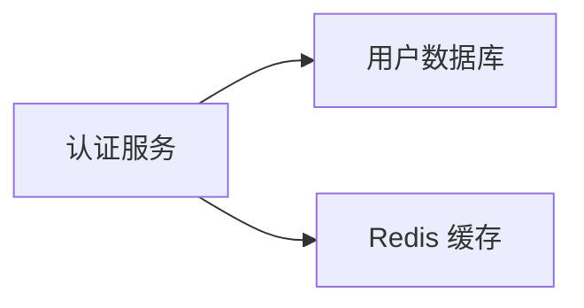

# Diagram Geometry Engine (DGE) — 设计文档

> **代号：** "Pretext for Graphics"
> **版本：** v0.1-draft
> **日期：** 2026-05-23
> **作者：** Based on research 2026-05-23

---

## 目录

1. [执行摘要](#1-执行摘要)
2. [问题陈述](#2-问题陈述)
3. [设计原则](#3-设计原则)
4. [系统架构](#4-系统架构)
5. [核心模块](#5-核心模块)
6. [API 设计](#6-api-设计)
7. [输入 DSL](#7-输入-dsl)
8. [输出格式](#8-输出格式)
9. [集成生态](#9-集成生态)
10. [实现路线图](#10-实现路线图)
11. [风险与缓解](#11-风险与缓解)
12. [成功标准](#12-成功标准)

---

## 1. 执行摘要

### 一句话

一个**确定性几何计算引擎**，将"高层图形意图"翻译为"精确数字坐标"，让 LLM 无需多模态也能生成精准图表。

### 核心洞察

现有工具分为两类，中间有一个未被填补的空隙：

```
自动布局引擎 (Dagre/Graphviz)     渲染引擎 (SVG/mxGraph/Excalidraw)
   └── 给我关系，我给你布局             └── 给我坐标，我给你画
   └── 你不能精确指定位置                └── 坐标你得自己猜
                        ↑
              ❌ 缺少：几何求解层
              "把意图翻译为坐标，纯数学、确定性、LLM 可给"
```

Pretext 证明了这种模式的价值：它用纯数学计算文本布局，消除了对 DOM/视觉反馈的依赖。DGE 是把同一思路扩展到整个图形空间。

### 关键定位

> **这个库不是渲染器。它是一个坐标计算器。** LLM 告诉它"我想要什么"，它返回"精确的位置"。LLM 拿到坐标后，再输出给任意渲染格式。

---

## 2. 问题陈述

### 2.1 用户痛点

非多模态的 LLM（文本模型、代码模型）编写图表时面临以下问题：

| 场景 | 当前做法 | 痛点 |
|------|---------|------|
| 画架构图 | 手工估算坐标 (x, y, w, h) | 反复试错，输出质量极低 |
| 画流程图 | 用自动布局放弃精确控制 | 无法表达意图（"A 在 B 左边 40px"） |
| 画连接线 | 猜锚点位置 | 箭头穿过框体、错位 |
| 文字换行 | 猜断行点 | 溢出容器或浪费空间 |
| 跨格式输出 | 每种格式重算一次 | 维护成本高，不一致 |

### 2.2 现有方案分析

参见调研中的详细对比表。关键结论：

- **Pretext** 解决了文字几何 ✅，但不处理形状/箭头/连线 ❌
- **Dagre** 解决了有向图布局 ✅，但不处理任意形状/精确坐标 ❌
- **Excalidraw JSON** 是格式标准，不提供计算能力
- **Architecture SVG skill** 我们在代码里硬算坐标，没有可复用库

### 2.3 核心需求

1. **文字测量** — 给定文本+字体，返回精确宽/高/断行（复用 Pretext）
2. **形状几何** — 计算形状的锚点、边界、碰撞盒、padding 后的实际尺寸
3. **连线路径** — 在形状之间计算正交/曲线路径，绕开障碍物
4. **自动布局** — 包装/增强 Dagre，支持精确覆盖
5. **标签排版** — 根据标签内容自动确定形状大小
6. **多格式输出** — 将计算结果映射到任意渲染格式

---

## 3. 设计原则

### 原则 1: 确定性优先

> 相同输入 → 相同输出。不能有随机布局、近似算法或跟视觉反馈相关的动态调整。

为什么：LLM 需要可预测性。如果每次调用返回不同坐标，LLM 无法调试自己的生成逻辑。

### 原则 2: 纯计算，零渲染

> 不操作 DOM，不依赖浏览器，不加载字体文件进行渲染。所有测量基于数学计算，可以在 Node.js、浏览器、Deno、Python 等任意运行时运行。

### 原则 3: 可插拔测量器

> 文字测量器作为接口抽象，默认用 Pretext（JS），允许替换为 Canvas 测量、Python Pillow 测量，或其他自定义实现。

### 原则 4: 分层架构

> 底层是独立几何库，上层是 DSL 解释器和格式导出器，每层可独立使用。

```
DSL → 几何求解 → 坐标 → 格式导出 → SVG/Excalidraw/drawio/ASCII
          ↑
     可插拔测量器 (Pretext / Canvas / ...)
```

### 原则 5: 渐进暴露

> 简单场景一行搞定（`Diagram.auto(nodes, edges)`），复杂场景每层都可深入定制（自定义锚点、走线策略、padding 规则）。

---

## 4. 系统架构

### 4.1 总体架构

```
┌────────────────────────────────────────────────────────┐
│                     Input DSL                           │
│  (YAML/JSON: nodes, edges, constraints, styles)         │
└────────────────────────┬───────────────────────────────┘
                         │
                         ▼
┌────────────────────────────────────────────────────────┐
│                DSL Parser & Validator                   │
│  解析 DSL → 内部 IR → 约束图 → 求解计划                  │
└────────────────────────┬───────────────────────────────┘
                         │
                         ▼
┌────────────────────────────────────────────────────────┐
│                 Geometry Solver                         │
│  ┌──────────┐ ┌──────────┐ ┌──────────┐ ┌──────────┐  │
│  │ Text     │ │ Shape    │ │ Layout   │ │ Routing  │  │
│  │ Measurer │ │ Geometry │ │ Engine   │ │ Engine   │  │
│  └────┬─────┘ └────┬─────┘ └────┬─────┘ └────┬─────┘  │
│       │            │            │            │         │
│  ┌────▼─────┐      │            │            │         │
│  │ Pretext  │      │            │            │         │
│  │ (pluggable)     │            │            │         │
│  └──────────┘      │            │            │         │
└────────────────────┼────────────┼────────────┼─────────┘
                     │            │            │
                     ▼            ▼            ▼
┌────────────────────────────────────────────────────────┐
│               Coordinated Output (IR)                   │
│  每个元素：{ id, x, y, width, height, anchors, path }  │
└────────────────────────┬───────────────────────────────┘
                         │
                         ▼
┌────────────────────────────────────────────────────────┐
│                Format Exporters                         │
│  ┌──────────┐ ┌──────────┐ ┌──────────┐ ┌──────────┐  │
│  │ SVG      │ │Excalidraw│ │ drawio   │ │ ASCII    │  │
│  │ Exporter │ │ Exporter │ │ Exporter │ │ Exporter │  │
│  └──────────┘ └──────────┘ └──────────┘ └──────────┘  │
└────────────────────────────────────────────────────────┘
```

### 4.2 内部数据流

```
1. DSL 输入（YAML/JSON）
   ↓
2. Internal Representation (IR)
   - NodeList: 每个 node 有 id, label, shapeType, style
   - EdgeList: 每个 edge 有 from, to, label, style
   - ConstraintList: 精确位置/间距/对齐约束
   ↓
3. 求解阶段
   a. Measure phase: 计算所有文字的尺寸
   b. Size phase: 根据标签+padding 确定形状尺寸
   c. Layout phase: 自动布局/约束解析 → 确定位置
   d. Anchor phase: 计算所有形状的锚点
   e. Route phase: 计算连线路径
   ↓
4. Coordinated IR（所有坐标已知）
   ↓
5. 格式导出
```

### 4.3 技术选型

| 层 | 候选方案 | 理由 |
|----|---------|------|
| 语言 | **TypeScript**（主）→ Python（副） | TS 生态（Pretext/Dagre 原生），Python 为 quantization/backtest 生态 |
| 文字测量 | `@chenglou/pretext` | 最精确的 DOM-free 测量，15KB |
| 图布局 | `@dagrejs/dagre` | JS 生态最好用的有向图布局引擎 |
| 形状几何 | **自研** | 现有生态无此抽象 |
| 路径走线 | **自研**（参考正交走线算法） | 可自包含，不复杂 |
| 格式导出 | **自研适配器** | 每种格式一个转换器 |
| 构建 | tsup / esbuild | 生成 cjs/esm 双格式 |

---

## 5. 核心模块

### 5.1 TextMeasurer（文字测量器）

**职责：** 给定文本+字体参数，返回精确的宽/高/每行断点/每字位位置。

**接口：**

```typescript
interface TextMeasurer {
  /** 测量一段文本在给定宽度下的精确布局 */
  measure(
    text: string,
    options: TextOptions,
    maxWidth?: number
  ): TextMeasurement;
}

interface TextOptions {
  fontSize: number;
  fontFamily: string;
  fontWeight?: number;     // 400, 500, 700
  lineHeight?: number;     // 默认 1.2
  letterSpacing?: number;
}

interface TextMeasurement {
  width: number;            // 实际宽度（或最大行宽）
  height: number;           // 总高度（含行距）
  lines: TextLine[];        // 每行详情
  graphemes: GraphemePos[]; // 每字位位置（可选）
}

interface TextLine {
  text: string;
  width: number;
  graphemeCount: number;
}

interface GraphemePos {
  index: number;
  x: number;
  y: number;
  char: string;
}
```

**实现：**
- 主实现包装 `@chenglou/pretext` 的 `prepare()` + `layout()` / `layoutWithLines()`
- 备选实现：HTML Canvas 2D context（浏览器环境）
- Python 包装：通过 subprocess 调用 Node.js 或 Pillow `ImageFont.getsize_multiline()`

**关键决策：** 为什么测量器必须是可插拔的？
- Pretext 在浏览器和 Node.js 都工作，但在 Python 环境需要替代
- 不同的渲染后端可能有不同的度量（Canvas vs SVG vs PDF）
- 可插拔接口让扩展不需要改核心逻辑

### 5.2 ShapeGeometry（形状几何）

**职责：** 计算形状的锚点、碰撞边界、padding，给定形状类型+尺寸。

```typescript
interface ShapeGeometry {
  /** 计算形状的锚点 */
  getAnchorPoints(
    shape: ShapeSpec
  ): Record<string, Point>;  // { top, bottom, left, right, center, topLeft, ... }

  /** 计算外包围盒（含 padding/shadow/border） */
  getOuterBox(shape: ShapeSpec): Box;

  /** 判断点是否在形状内 */
  containsPoint(shape: ShapeSpec, point: Point): boolean;

  /** 检测两个形状是否碰撞 */
  overlaps(a: ShapeSpec, b: ShapeSpec): boolean;

  /** 计算从形状边缘到某方向点的最近出口点 */
  getEdgePoint(shape: ShapeSpec, direction: Direction): Point;
}

interface ShapeSpec {
  type: 'rectangle' | 'rounded-rectangle' | 'ellipse' | 'diamond' | 'parallelogram' | 'hexagon' | 'cylinder';
  x: number;
  y: number;
  width: number;
  height: number;
  rx?: number;           // 圆角半径
  padding?: Padding;
}

interface Padding {
  top: number;
  right: number;
  bottom: number;
  left: number;
}

interface Point { x: number; y: number; }
interface Box  { x: number; y: number; width: number; height: number; }
```

**锚点位置计算（核心函数）：**

| 形状 | 顶部中心 | 右侧中心 | 底部中心 | 左侧中心 | 角点 |
|------|---------|---------|---------|---------|------|
| 矩形 | (x+w/2, y) | (x+w, y+h/2) | (x+w/2, y+h) | (x, y+h/2) | 四个角分别 |
| 圆角矩形 | 同上（边退让 rx） | 同上 | 同上 | 同上 | 同上 |
| 椭圆 | (x+w/2, y) | (x+w, y+h/2) | (x+w/2, y+h) | (x, y+h/2) | 45° 斜角 |
| 菱形 | (x+w/2, y) | (x+w, y+h/2) | (x+w/2, y+h) | (x, y+h/2) | 四个顶点 |
| 平行四边形 | 偏移顶边 | 右侧 | 偏移底边 | 左侧 | 四个角偏移 |

### 5.3 LayoutEngine（布局引擎）

**职责：** 给一组节点+边，计算每个节点的 (x, y) 坐标，支持自动布局和精确约束。

```typescript
interface LayoutEngine {
  /** 纯自动布局（底层走 Dagre） */
  auto(input: LayoutInput): LayoutResult;

  /** 混合布局：部分精确，部分自动 */
  hybrid(input: LayoutInput, fixed: FixedNode[]): LayoutResult;
}

interface LayoutInput {
  nodes: { id: string; width: number; height: number; label?: string }[];
  edges: { id?: string; from: string; to: string }[];
  direction?: 'TB' | 'LR' | 'BT' | 'RL';  // 默认 TB
  nodeSep?: number;    // 同层间距
  rankSep?: number;    // 层间距
}

interface LayoutResult {
  nodes: { id: string; x: number; y: number }[];
  edges: { id: string; from: string; to: string; points: Point[] }[];
  width: number;       // 布局总宽
  height: number;      // 布局总高
}
```

**约束系统（高级）：**

```typescript
interface Constraint {
  type: 'exact' | 'relative' | 'align' | 'distribute' | 'pad';
  // exact: { nodeId: "A", x: 100, y: 200 }
  // relative: { from: "A", to: "B", dx: 40, dy: 0 }
  // align: { nodes: ["A","B","C"], axis: "y" }
  // distribute: { nodes: ["A","B","C"], axis: "x", margin: 20 }
  // pad: { nodeId: "A", containerId: "box1", padding: 16 }
}
```

**实现策略：**
1. 先用 Dagre 计算初始布局
2. 应用精确覆盖约束（override Dagre 的结果）
3. 约束求解采用简单的 CSP 求解器（数值迭代法，无需 SAT/SMT）

### 5.4 RouteEngine（走线引擎）

**职责：** 计算两个形状之间的最优连线路径（正交/曲线），自动避障。

```typescript
interface RouteEngine {
  /** 计算两点间的最短路径 */
  route(
    from: Point,
    to: Point,
    options?: RouteOptions
  ): Point[];

  /** 计算两点间的最短路径（考虑障碍物） */
  routeWithObstacles(
    from: Point,
    to: Point,
    obstacles: Box[],
    options?: RouteOptions
  ): Point[];

  /** 计算两个形状之间的最优连接路径 */
  connect(
    fromShape: ShapeSpec,
    toShape: ShapeSpec,
    fromAnchor?: string,   // 默认 'right'
    toAnchor?: string,      // 默认 'left'
    obstacles?: Box[],
    options?: RouteOptions
  ): { points: Point[]; fromPoint: Point; toPoint: Point };
}

interface RouteOptions {
  style?: 'orthogonal' | 'curved' | 'straight';
  margin?: number;          // 与障碍物的间距
  minSegmentLength?: number; // 最小线段长度
}
```

**走线算法：**

```
正交走线（主线策略）：
1. 起点 → 垂直/水平 → 中间走廊 → 垂直/水平 → 终点
2. 如果直线路径被障碍物阻挡：
   - 使用 A* 搜索在网格中寻找绕行路径
   - 网格粒度：最小线段长度的 1/2
3. 路径后处理：合并共线线段，去除冗余拐点

曲线走线（备选）：
1. 计算起点锚点到终点锚点的贝塞尔曲线
2. 控制点根据方向偏移
3. 检测曲线是否穿过障碍物，如穿过则增加中间控制点
```

### 5.5 LabelFitter（标签自动定尺寸）

**职责：** 根据标签内容+样式，自动确定形状尺寸。

```typescript
interface LabelFitter {
  /** 测量标签，返回最适合的 (width, height) */
  fit(
    label: string,
    options: LabelFitOptions
  ): { width: number; height: number; measurement: TextMeasurement };

  /** 给定最大宽度，返回最小尺寸 */
  fitWithMaxWidth(
    label: string,
    maxWidth: number,
    options: LabelFitOptions
  ): { width: number; height: number; measurement: TextMeasurement };
}

interface LabelFitOptions {
  fontSize: number;
  fontFamily: string;
  padding?: Padding | number;  // number = 四边统一 padding
  minWidth?: number;           // 最小宽度
  minHeight?: number;          // 最小高度
  textMeasurer?: TextMeasurer; // 可插拔
  multiLine?: boolean;         // 是否允许换行
}
```

**实现逻辑：**

```
1. 用 TextMeasurer 测量标签文字
2. 结果 = 文字尺寸 + padding (左+右, 上+下)
3. 如果结果 < minWidth/minHeight，用最小值
4. 如果 multiLine=true，在 maxWidth 限制下自动换行
5. 返回最终尺寸和精确的 TextMeasurement（供格式导出器使用）
```

### 5.6 格式导出器

**职责：** 将协调后的坐标 IR 转换为目标格式。

```typescript
interface FormatExporter {
  export(diagram: CoordinatedDiagram): string;
}

interface CoordinatedDiagram {
  width: number;
  height: number;
  shapes: CoordinatedShape[];
  edges: CoordinatedEdge[];
  texts: CoordinatedText[];
}

interface CoordinatedShape {
  id: string;
  type: string;
  x: number; y: number;
  width: number; height: number;
  style: ShapeStyle;
}

interface CoordinatedEdge {
  id: string;
  points: Point[];
  fromShape: string;
  toShape: string;
  style: EdgeStyle;
}

interface CoordinatedText {
  id: string;
  text: string;
  x: number; y: number;
  width: number; height: number;
  style: TextStyle;
}
```

**支持格式：**

| 格式 | 优先度 | 实现复杂度 | 说明 |
|------|--------|-----------|------|
| Excalidraw JSON | P0 | 低 | 已有 skill 可参考 |
| SVG | P0 | 中 | 最通用，熟悉 |
| drawio XML | P1 | 中 | mxGraph 格式，已有参考 |
| Mermaid | P1 | 低 | 纯 DSL，不依赖坐标 |
| ASCII/Unicode | P2 | 中 | 框线图，终端友好 |
| TikZ | P3 | 高 | LaTeX 用户 |

---

## 6. API 设计

### 6.1 高层 API（一句搞定）

```typescript
// 最简单用例：给关系，出结果
const diagram = await Diagram.create({
  nodes: [
    { id: "auth", label: "认证服务" },
    { id: "db", label: "用户数据库" },
    { id: "cache", label: "Redis 缓存" },
  ],
  edges: [
    { from: "auth", to: "db", label: "读写" },
    { from: "auth", to: "cache", label: "缓存" },
  ],
  direction: "LR",
});

// 输出格式
const svg = diagram.toSVG();
const excalidraw = diagram.toExcalidraw();
```

### 6.2 中层 API（控制布局）

```typescript
// 混合布局：固定部分位置，自动排其余
const diagram = await Diagram.hybrid({
  nodes: [
    { id: "gateway", label: "API 网关", fixed: true, x: 400, y: 50 },
    { id: "service-a", label: "服务 A" },
    { id: "service-b", label: "服务 B" },
    { id: "db", label: "数据库", fixed: true, x: 400, y: 400 },
  ],
  edges: [
    { from: "gateway", to: "service-a" },
    { from: "gateway", to: "service-b" },
    { from: "service-a", to: "db" },
    { from: "service-b", to: "db" },
  ],
});
```

### 6.3 底层 API（完全控制）

```typescript
import { TextMeasurer } from "./text";
import { ShapeGeometry } from "./shape";
import { LayoutEngine } from "./layout";
import { RouteEngine } from "./route";

// 步骤 1: 测量所有标签
const measurer = new TextMeasurer({ backend: "pretext" });
const sizes = nodes.map(n => ({
  ...n,
  ...LabelFitter.fit(n.label, { fontSize: 14, padding: 12, textMeasurer: measurer }),
}));

// 步骤 2: 布局
const layout = LayoutEngine.auto({
  nodes: sizes,
  edges,
  direction: "TB",
});

// 步骤 3: 计算锚点
const geometry = new ShapeGeometry();
const anchors = layout.nodes.map(n => ({
  id: n.id,
  anchors: geometry.getAnchorPoints({ type: "rounded-rectangle", ...n, rx: 4 }),
}));

// 步骤 4: 走线
const router = new RouteEngine();
const paths = edges.map(e => {
  const fromAnchor = anchors.find(a => a.id === e.from);
  const toAnchor = anchors.find(a => a.id === e.to);
  return router.connect(fromAnchor.anchors.right, toAnchor.anchors.left);
});
```

### 6.4 约束覆盖 API

```typescript
// 精确指定位置的覆盖
const diagram = await Diagram.fromConstraints({
  nodes: [
    { id: "title", label: "系统架构图 v2.0", pos: { x: 400, y: 20 } },
  ],
  constraints: [
    { type: "relative", from: "gateway", to: "service-a", dx: 0, dy: 80 },
    { type: "align", nodes: ["service-a", "service-b", "service-c"], axis: "y" },
    { type: "distribute", nodes: ["service-a", "service-b", "service-c"], axis: "x", margin: 40 },
  ],
});
```

---

## 7. 输入 DSL

### 7.1 YAML DSL（推荐给 LLM 使用）

LLM 用 YAML 描述图表意图，DSL 简洁、易解析、支持约束表达。

```yaml
# 简单图表示例
title: 用户认证流程
direction: LR      # 左到右

nodes:
  - id: client
    label: 客户端
    shape: rectangle
    color: blue

  - id: gateway
    label: API 网关
    shape: rounded-rectangle

  - id: auth
    label: 认证服务
    shape: rounded-rectangle

  - id: db
    label: 用户数据库
    shape: cylinder    # 数据库图标
    color: purple

edges:
  - from: client
    to: gateway
    label: HTTP 请求

  - from: gateway
    to: auth
    label: 转发

  - from: auth
    to: db
    label: 查询
    style: dashed
```

```yaml
# 高级：含约束和分组
title: 微服务架构
direction: TB

nodes:
  - id: ingress
    label: Ingress
    fixed: { x: 500, y: 50 }

  - id: svc-a
    label: 订单服务
    width: 160

  - id: svc-b
    label: 库存服务
    width: 160

  - id: svc-c
    label: 支付服务
    width: 160

  - id: db-a
    label: 订单 DB
    shape: cylinder

  - id: db-b
    label: 库存 DB
    shape: cylinder

  - id: queue
    label: 消息队列
    shape: rectangle
    color: orange

edges:
  - from: ingress
    to: [svc-a, svc-b, svc-c]   # 自动展开三条边

  - from: svc-a
    to: db-a

  - from: svc-b
    to: db-b

  - from: svc-a
    to: queue
    label: 异步

  - from: svc-c
    to: queue
    label: 消费

groups:
  - id: backend
    label: 后端集群
    border: dashed
    color: gray
    contains: [svc-a, svc-b, svc-c, db-a, db-b]

constraints:
  - align: [svc-a, svc-b, svc-c]
    axis: y
  - distribute: [svc-a, svc-b, svc-c]
    axis: x
    margin: 30
```

### 7.2 JSON Schema

```json
{
  "$schema": "http://json-schema.org/draft-07/schema#",
  "type": "object",
  "properties": {
    "title": { "type": "string" },
    "direction": { "type": "string", "enum": ["TB", "LR", "BT", "RL"], "default": "TB" },
    "nodes": {
      "type": "array",
      "items": {
        "type": "object",
        "required": ["id", "label"],
        "properties": {
          "id": { "type": "string" },
          "label": { "type": "string" },
          "shape": { 
            "type": "string", 
            "enum": ["rectangle", "rounded-rectangle", "ellipse", "diamond", "parallelogram", "hexagon", "cylinder"],
            "default": "rounded-rectangle"
          },
          "width": { "type": "number", "minimum": 40 },
          "height": { "type": "number", "minimum": 20 },
          "fixed": { "$ref": "#/$defs/Position" },
          "color": { "type": "string" },
          "style": { "$ref": "#/$defs/Style" }
        }
      }
    },
    "edges": {
      "type": "array",
      "items": {
        "type": "object",
        "required": ["from", "to"],
        "properties": {
          "from": { "type": "string" },
          "to": { "oneOf": [{ "type": "string" }, { "type": "array", "items": { "type": "string" } }] },
          "label": { "type": "string" },
          "style": { "$ref": "#/$defs/EdgeStyle" },
          "fromAnchor": { "type": "string" },
          "toAnchor": { "type": "string" }
        }
      }
    },
    "groups": {
      "type": "array",
      "items": {
        "type": "object",
        "required": ["id", "contains"],
        "properties": {
          "id": { "type": "string" },
          "label": { "type": "string" },
          "border": { "type": "string", "enum": ["solid", "dashed", "dotted"] },
          "color": { "type": "string" },
          "contains": { "type": "array", "items": { "type": "string" } }
        }
      }
    },
    "constraints": {
      "type": "array",
      "items": { "$ref": "#/$defs/Constraint" }
    },
    "output": {
      "type": "object",
      "properties": {
        "format": { "type": "string", "enum": ["svg", "excalidraw", "drawio", "mermaid", "ascii", "all"] },
        "path": { "type": "string" }
      }
    }
  },
  "$defs": {
    "Position": { "type": "object", "required": ["x", "y"], "properties": { "x": { "type": "number" }, "y": { "type": "number" } } },
    "Style": { "type": "object", "properties": { "fontSize": { "type": "number" }, "fontFamily": { "type": "string" }, "padding": { "type": "number" } } },
    "EdgeStyle": { "type": "object", "properties": { "style": { "type": "string", "enum": ["solid", "dashed", "dotted"] }, "arrowHead": { "type": "string" }, "color": { "type": "string" } } },
    "Constraint": {
      "type": "object",
      "oneOf": [
        { "properties": { "type": { "const": "align" }, "nodes": { "type": "array", "items": { "type": "string" } }, "axis": { "type": "string", "enum": ["x", "y"] } }, "required": ["type", "nodes", "axis"] },
        { "properties": { "type": { "const": "distribute" }, "nodes": { "type": "array", "items": { "type": "string" } }, "axis": { "type": "string", "enum": ["x", "y"] }, "margin": { "type": "number" } }, "required": ["type", "nodes", "axis", "margin"] },
        { "properties": { "type": { "const": "relative" }, "from": { "type": "string" }, "to": { "type": "string" }, "dx": { "type": "number" }, "dy": { "type": "number" } }, "required": ["type", "from", "to"] }
      ]
    }
  }
}
```

### 7.3 DSL 设计原则

1. **对人类和 LLM 都易写** — YAML 比 JSON 更适合 LLM 生成
2. **渐进复杂度** — 简单图 5 行搞定，复杂图逐步添加
3. **约束而非编程** — DSL 声明"想要什么"，引擎负责"怎么算"
4. **意图保留** — DSL 本身可作呈现格式，LLM 可读性优于内部 IR

---

## 8. 输出格式

### 8.1 架构概览

```
几何求解器输出 (CoordinatedDiagram)
  ├── SVG —— 最通用，直接可看
  ├── Excalidraw JSON —— 可编辑，二次修改友好
  ├── drawio XML —— 嵌入 draw.io 生态
  ├── Mermaid —— 纯文本，Markdown 友好
  └── ASCII/Unicode —— 终端/Slack/QQ 友好
```

### 8.2 SVG 导出

最常用的输出格式。核心挑战：**坐标到 SVG 元素的映射。**

```typescript
class SvgExporter implements FormatExporter {
  export(diagram: CoordinatedDiagram): string {
    // 1. 创建 SVG 根元素（含 viewBox）
    // 2. 绘制 defs（箭头标记、渐变、滤镜）
    // 3. 绘制 edges（路径元素）
    // 4. 绘制 shapes（rect, ellipse, path 等）
    // 5. 绘制 text（text 元素，需要换行处理）
    // 6. 绘制 groups（边界框）
    // 7. 组合为完整 SVG 字符串
    return svgString;
  }
}
```

**文本对齐（SVG 特有难点）：**
- SVG `<text>` 不自动换行
- 每个 `<tspan>` 对应一行，`x` 固定，`y` 递增
- 居中文字：`text-anchor="middle"` + `x=centerX`
- 多行居中：每行 `x=centerX`，`y` 逐步递进

### 8.3 Excalidraw JSON 导出

已有成熟的 skill 参考格式。

**坐标系映射：**
- Excalidraw 使用 (x, y) 为左上角，与我们的 IR 一致
- 每个形状 + 绑定的文字元素需要生成独立 objects
- 箭头需要 `startBinding` / `endBinding` 和 `points`

### 8.4 drawio XML 导出

drawio 使用 mxGraph 格式，每个 `<mxCell>` 的 `<mxGeometry>` 记录坐标。

```xml
<mxCell id="1" value="认证服务" style="rounded=1;whiteSpace=wrap;html=1;" vertex="1">
  <mxGeometry x="120" y="60" width="120" height="40" as="geometry"/>
</mxCell>
```

**挑战：** drawio 的 `relative` 坐标系（子节点坐标相对于父节点），需要递归处理分组。

### 8.5 Mermaid 导出

Mermaid 是纯 DSL 格式，不依赖坐标。当图是纯关系图（无精确坐标需求时）可用。



DGE 可提供"Mermaid 优先级"模式：如果用户不需要精确坐标，直接输出 Mermaid 代码，绕过硬算坐标的开销。

### 8.6 ASCII/Unicode 导出

终端友好格式，使用框线字符。

```
 ┌──────────┐     ┌──────────┐
 │ API 网关 │────▶│ 认证服务  │
 └──────────┘     └────┬─────┘
                       │
                       ▼
                 ┌──────────┐
                 │ 数据库    │
                 └──────────┘
```

**实现：** 基于精确坐标，将其离散化到字符网格，然后绘制框线。

---

## 9. 集成生态

### 9.1 与现有 Hermes Skills 的关系

```
DGE
├── 底层几何计算库              ← 新项目
├── 可被调用：
│   ├── architecture-diagram skill  → 提供坐标，替代硬算
│   ├── excalidraw skill            → 提供坐标，生成精确排版的图
│   └── 新 skill（DGE-native）       → 一站式：DSL 输入 → 任意格式输出
└── 输入格式兼容：
    └── 已有的 DSL（d2-like）可按适配器映射到 DGE DSL
```

### 9.2 LLM 使用流程

```
LLM 生成 DSL
    │
    ▼
LLM 调用 dge-cli --input diagram.yaml --format svg --output diagram.svg
    │
    ▼
DGE 返回精确坐标的 SVG（或 Excalidraw/drawio/...）
    │
    ▼
LLM 直接输出 SVG 内容区块（无多模态协调开销）
```

**关键优势：** LLM 不需要看到图来调整位置。它只需要调整 DSL 参数（如 `direction: "TB"` → `"LR"`），DGE 保证输出在数学上是正确的。

### 9.3 Python 生态

Python 版的 DGE（可称为 `py-dge`）与 TS 版共享相同接口规范，用于：
- 量化报告自动生成图表
- 数据科学工作流的可视化
- 与 Hermes 的 Python stack 集成

实现策略：TS 先出 → 验证 API 设计 → Python 翻译。

---

## 10. 实现路线图

### Phase 0: 可行性验证（1-2 周）

**目标：** 最小的端到端原型，验证核心假设。

```
交付物：一个 Node.js 脚本，接收简易 DSL，输出 SVG

输入 DSL:
  nodes:
    - id: a, label: "A", x: 100, y: 100
    - id: b, label: "B", x: 300, y: 200
  
输出: 包含两个带标签矩形 + 箭头连线的 SVG
```

**关键验证点：**
1. Pretext 在 Node.js 环境工作正常 ✅
2. 文字 + padding → 形状尺寸计算一致 ✅
3. 锚点计算正确 ✅
4. 正交连线可达基本可用 ✅
5. SVG 导出满足展示需求 ✅

**不需要在 Phase 0 做的：**
- 自动布局（硬编码坐标即可）
- 约束系统
- 多格式输出（仅 SVG）
- 命令行界面

### Phase 1: 核心库（3-4 周）

**目标：** 完整的 TS 库，可安装使用。

- [ ] TextMeasurer 模块（包装 Pretext，含 fallback 测量器）
- [ ] ShapeGeometry 模块（6 种形状的锚点/碰撞/出口点）
- [ ] LayoutEngine 模块（Dagre 包装 + 约束覆盖）
- [ ] RouteEngine 模块（正交走线 + A* 避障）
- [ ] LabelFitter 模块
- [ ] SVG Exporter（完整实现，含 defs/分组/文本换行）
- [ ] Excalidraw Exporter
- [ ] DSL Parser（YAML/JSON 输入 → IR）
- [ ] 单元测试（覆盖所有核心函数）
- [ ] NPM 包发布（`@diagram-geometry/core`）

### Phase 2: 工具与集成（2-3 周）

**目标：** CLI 工具 + 与 Hermes 集成。

- [ ] CLI: `dge --input diagram.yaml --format svg --output out.svg`
- [ ] CLI: 支持管道输入（`cat diagram.yaml | dge --format excalidraw > out.excalidraw`）
- [ ] Hermes 新 skill: `diagram-engine`（一步式 DSL → 任意格式）
- [ ] 更新 `architecture-diagram` skill 使用 DGE 替代硬算
- [ ] 更新 `excalidraw` skill 集成 DGE 排版能力
- [ ] 自动布局增强（混合模式：部分固定 + 部分自动）

### Phase 3: 进阶功能（2-4 周）

**目标：** 成熟度提升，支持复杂场景。

- [ ] drawio XML Exporter
- [ ] ASCII/Unicode Exporter
- [ ] 约束求解器（完整支持 align/distribute/relative/container）
- [ ] 智能分组（自动计算 group 边界框 + padding）
- [ ] 布局预览模式（输出 HTML 可交互预览，供 LLM "查看" 但不依赖多模态）
- [ ] Python 版移植（`py-dge`，核心算法翻译）
- [ ] 性能优化（大型图的缓存/增量计算）
- [ ] 文档站点 + 交互式 Playground

### Phase 4: 生态扩展（持续）

- [ ] Mermaid 互转（DGE DSL ↔ Mermaid）
- [ ] d2 格式互转
- [ ] Obsidian 插件
- [ ] VS Code 扩展（预览 DSL → 实时渲染）
- [ ] MCP Server（让任何 LLM 通过 MCP 调用 DGE）
- [ ] 社区模板库

---

## 11. 风险与缓解

| 风险 | 概率 | 影响 | 缓解 |
|------|------|------|------|
| Pretext 在 Node.js 的测量精度不如浏览器 | 低 | 中 | 备选测量器（Canvas polyfill）+ 对照测试 |
| Dagre 包装后的约束覆盖产生冲突 | 中 | 中 | 约束求解用分层策略：精确约束 > 布局建议 > Dagre 默认 |
| 自动化布局结果与用户期望差距大 | 中 | 高 | 提供"预览模式"+ 迭代式调整 API |
| 正交走线 A* 在大图上性能差 | 低 | 中 | 空间分区 + 路径缓存 + 启发式剪枝 |
| Python 版精度与 TS 版不一致 | 中 | 低 | 共享测试用例，浮点误差控制在 ±0.5px 内 |
| 用户不需要另一个"画图库" | 低 | 高 | 定位不是画图库，是**几何计算器**，与已有生态互补 |
| LLM 生成 DSL 质量不稳定 | 中 | 中 | Schema 严格校验 + 友好的错误信息 + 自动修复建议 |

### 关键缓解策略：预览模式

在没有多模态的情况下，LLM 如何验证生成结果？**预览模式：**

```
LLM 生成 DSL
  → DGE 计算坐标
  → 生成自包含的 HTML 预览文件（含交互式拖拽调整）
  → LLM 告诉用户"运行 dge preview diagram.yaml 看看"
  → 用户反馈（"A 太靠右了"、"间距太大"）
  → LLM 调整 DSL 参数
  → 迭代直到满意
```

这种模式让 LLM + 人类协作，通过"人类看、LLM 调"的循环，绕过多模态需求。

---

## 12. 成功标准

### MVP 标准（Phase 1 完成时）

```
一个 Node.js 程序，接收：
  - YAML DSL（7.1 节的格式）
  - 输出格式 (svg | excalidraw)
输出：
  - 精确排版的图表文件
  - 文字不溢出、箭头不错位、布局合理
  - 相同输入 → 相同输出
场景验证：
  - 3 层架构图（LB → Web → DB）
  - 流程图（含条件分支）
  - 带标签的箭头
  - 混合布局（部分固定 + 部分自动）
```

### 交付指标

| 指标 | 目标 |
|------|------|
| 精确坐标准确率 | >99%（文字溢出/箭头错位/碰撞 <1%） |
| 布局到渲染 | 一步完成，无需人工调坐标 |
| DSL → SVG 延迟 | <100ms（20 节点以下） |
| 输出格式 | ≥3 种 (SVG, Excalidraw, drawio) |
| 形状类型 | ≥6 种 |
| 约束类型 | ≥4 种 (exact, relative, align, distribute) |

### 非目标

- ❌ 不是 Visio/drawio 的替代品（我们是计算层，不是编辑器）
- ❌ 不做富交互（不提供在线拖拽编辑）
- ❌ 不做 SVG 美化（样式交给上层的 `architecture-diagram` skill）
- ❌ 不支撑实时协作
- ❌ 不做非确定性布局（如力导向布局的随机初始化）

---

## 附录 A: 关键算法引用

### A.1 正交走线（Orthogonal Routing）

参考以下论文的简化实现：
- *"A VLSI Maze Routing Algorithm"* — 基础迷宫走线
- *"Orthogonal Graph Drawing with Constraints"* — 约束下的正交布局

实际实现采用 A* 在网格上搜索，加上路径平滑后处理。

### A.2 锚点计算

参考 W3C 图形规范的 `marker` 定位原理，加上 mxGraph 的 `mxConstants` 中定义的形状出口点规则。

### A.3 约束求解

参考 Cassowary 算法的简化版（Apple Auto Layout 的底层算法）。DGE 不需要完整的线性规划求解器，只需要一个友好的增量约束求解器，约束数量通常 < 50 个。

---

## 附录 B: 与 Pretext 的类比

| Pretext 做了什么 | DGE 做什么 |
|-----------------|-----------|
| 输入文本 → 输出每字位位置 | 输入图形意图 → 输出每个元素坐标 |
| `prepare(text, font)` | `Diagram.create(nodes, edges)` |
| `layout(prepared, width, height)` | `engine.layout(nodes, edges, direction)` |
| `layoutNextLineRange(cursor, width)` | `routeEngine.connect(anchorA, anchorB)` |
| 纯数学计算，不依赖 DOM | 纯数学计算，不渲染 |
| 可插拔：适合各种字体 | 可插拔：适配各种输出格式 |
| 解决了"文字在空间中多宽"的问题 | 解决"图形在空间中放哪"的问题 |
